# Atomic SWap Awesome DEX

This is a demo with a basic UI to showcase the use of Atomic Swaps to build a functioning DEX.

### Setting up

Install _Metamask_ extension and set it to the Ropsten testnet.

```
cd frontend
npm install
npm start
```

Access the app on `localhost:3000`.
#### Workflow instruction - reproduced from [Apriorit](https://github.com/apriorit/atomic_swap_dex_demo)

To initiate exchange switch to Alice and to go _Create order_ page.

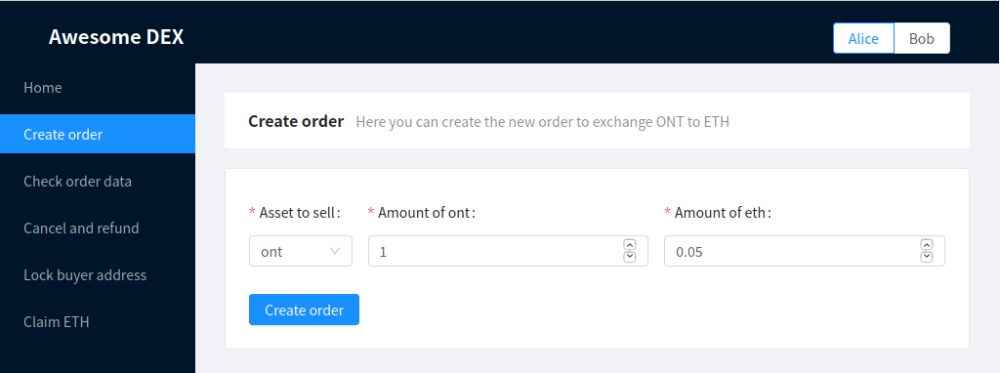

When transaction is completed, respective amount of ont will be transferred from Alice to smart contract.
The following message will appear:

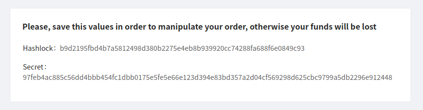

Save this values, otherwise access to the locked ONT will be permanently lost.

Now it's time for Bob to respond to Alice's order.
We assume that Bob knows hashlock and order details already (f.e. through using some public order book aggregator), but that is not significant in terms of our demo.

Let's switch to Bob and go to _Respond to order_ page:

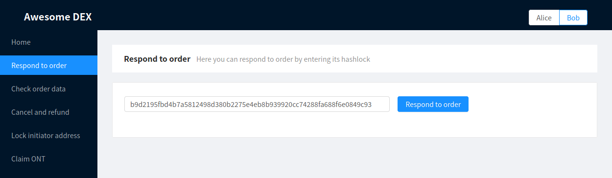

Here Bob inputs hashlock of the order he wants to respond to.
Amount of ETH to be locked on Ethereum SC from Bob is automatically set from value in corresponding Ontology contract.

Now both Alice and Bob can persuade that order was initiated correctly:

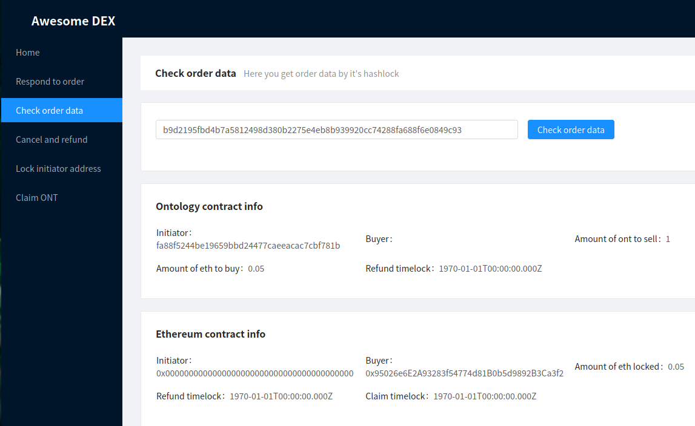

Notice, how Ontology contract holds Alice's Ontology address (presented in hex) and Ethereum contract holds Bob's Ethereum address.

Say, someone changes his/her mind in any poin of time before locking addresses of other party.
In this case, refunding can take place.
Refund is also possible if other party's address was locked, but only after refund timelock.

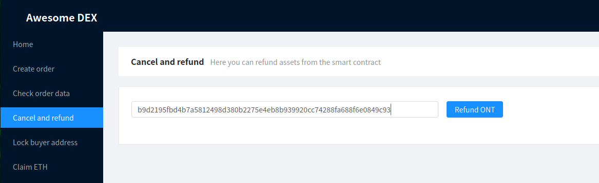

Use refund from Alice's account to refund ONT and from Bob's account to refund ETH.
Refunding will only work if assets were not claimed by other party.

Now that Bob responded to Alice's order, she should lock buyer Ontology address.
It's a good idea to check order data first and verify, that appropriate amount of ETH was indeed locked.

After making sure that amount of ETH is sufficient, Alice goes to _Lock buyer address_ page:

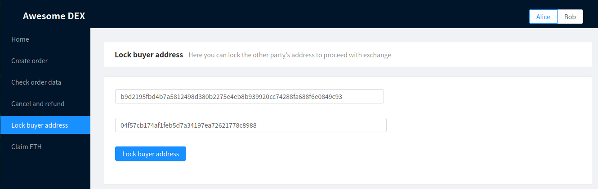

Notice, that Bob's Ontology address (hex representation) is inputted beforehand for convenience.

Now Bob should check order data and make that his Ontology address is correct.

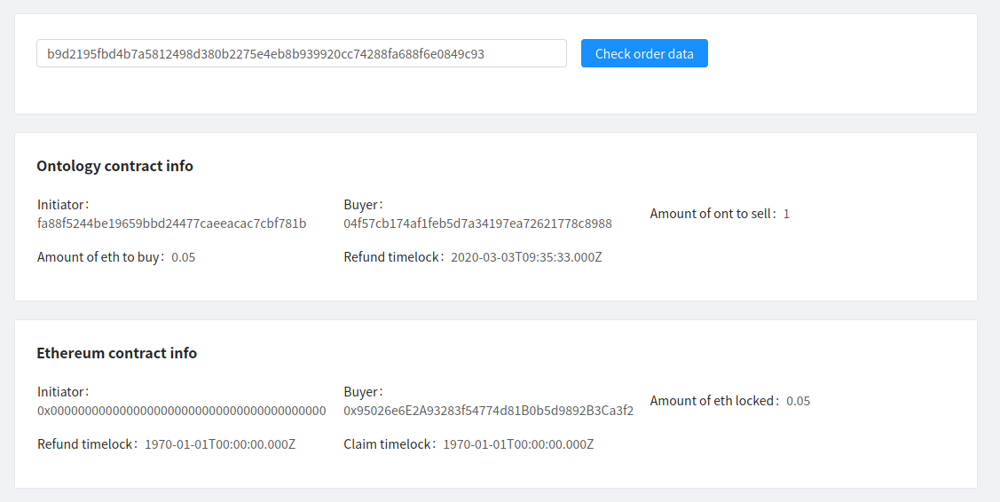

After that Bob goes to _Lock initiator address page_ and locks Alice Ethereum address (inputted beforehand as well).

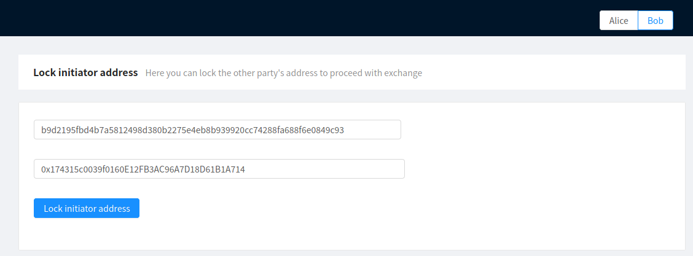

Exchange is almost completed. At this point revealing secret and claiming assets should take place.

Please note, that timelocks set in deployed testnet contracts are set to 10 seconds for purposes of quick proof of concept testing.
In real DEX timelocks should be 24h and 48h, instead of 10 and 20 seconds in Ethereum and Ontology contracts respectively.
It is also unsafe to perform claim after refund timelock time in a real exchange situation.

Alice now ensures, that her Ethereum address is correct:

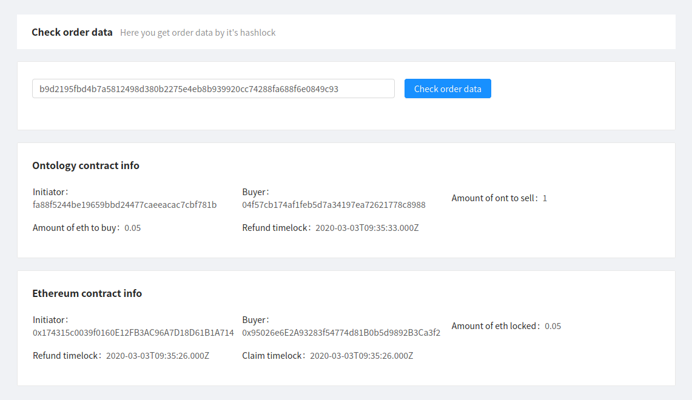

She uses that address to send secret to Ethereum SC and claim her ETH from _Claim ETH_ page:

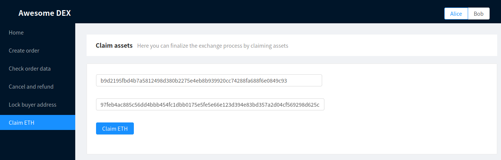

The secret was revealed, Bob can get this value from _Check order data_ page:

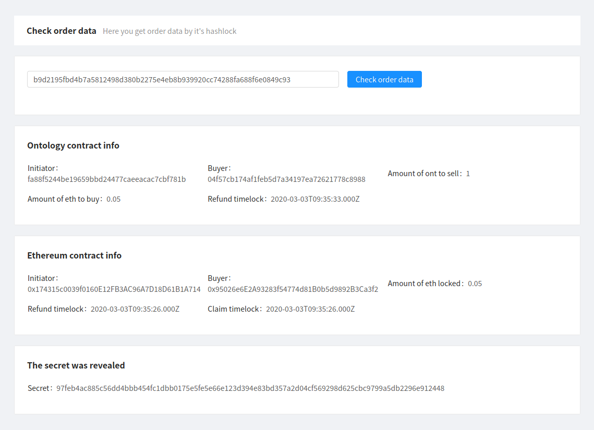

Bob copies the value of secret and inputs it on _Claim ONT_ page:

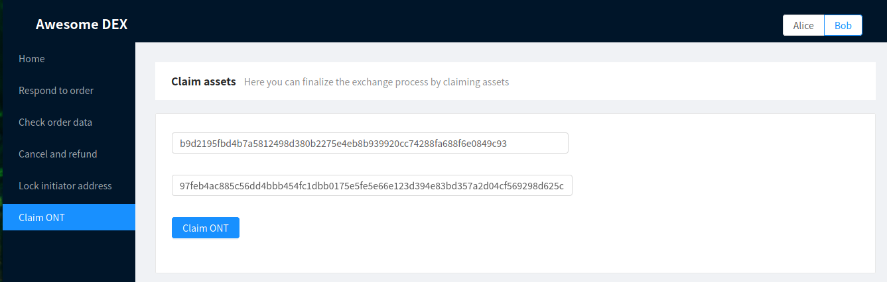

That's it, exchange was performed successfully.
